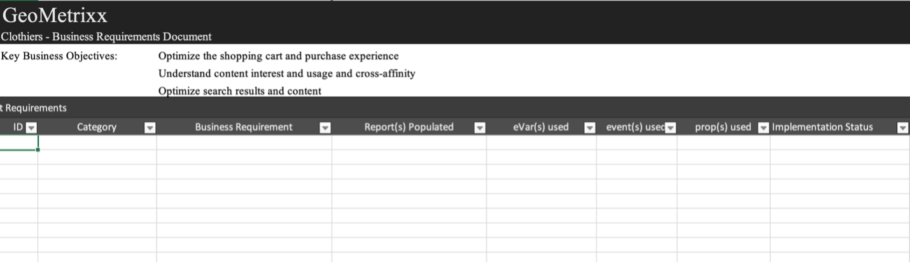

# Descargar el manual de implementación de Adobe Analytics

Antes de empezar, [descargar el libro de reproducción](assets/aa-implementation-playbook.xlsx).

## Ficha Requisitos empresariales

**QUÉ:** Un documento de requisitos empresariales (denominado comúnmente BRD) es una documentación muy importante en la que los principales interesados, los usuarios empresariales y los usuarios de tecnología querrán colaborar. Es un lugar para documentar todos los KPI deseados, los requisitos de informes y cualquier punto de datos que desee ver cuando se complete la implementación de Adobe Analytics (AA).

**POR QUÉ:** Esto sirve como punto de partida para la documentación siguiente (SDR, especificaciones técnicas, etc.) y es una fuente común de verdad para un estado final acordado de AA. Este documento organiza las ideas entre los equipos de la organización para formar una guía que le lleve a avanzar en la creación o mejora de su implementación.

**CÓMO:** La documentación de los requisitos comerciales la suelen realizar los usuarios finales de las empresas de AA, pero es importante recibir comentarios de los usuarios de tecnología, ya que puede haber desafíos técnicos que tener en cuenta y algunos puntos de datos pueden requerir más esfuerzo que otros, lo que influye en la priorización.

Pregúntese &quot;cuáles son las cosas que queremos rastrear en nuestro sitio&quot;, &quot;qué puntos de datos serán importantes para mí en el uso de los informes&quot; y, lo más importante, &quot;cómo informarán estos puntos de datos sobre las decisiones&quot;. Es importante asegurarse de que cada uno de los requisitos de su negocio esté relacionado con un punto de datos que pueda utilizarse para informar las decisiones comerciales. Por ejemplo: puede ser tentador querer rastrear cada clic en su sitio, pero al final del día, ¿qué perspectivas están obteniendo de ese informe?

Comience por rellenar la columna C en la captura de pantalla siguiente (Requisito comercial). Esto debería ser algo como &quot;Cuántas búsquedas internas se completan en nuestro sitio&quot; o &quot;Qué campaña interna es más efectiva en términos de impresiones&quot;. Después de completar este nivel de detalle, puede volver atrás y rellenar la columna B (Categoría) y agrupar los requisitos en categorías como &quot;Búsqueda&quot; o &quot;Promoción interna&quot; que deberían corresponder perfectamente con las secciones de especificaciones técnicas.

También indicará si cree que el uso de un eVar, evento, propiedad o combinación logrará lo que busca rastrear.

Y por último, la columna Estado de implementación servirá como una comprobación de estado cuando comience a agregar cosas al sitio.

## Ficha Mapa de variables (etiquetado doc/SDR)

**QUÉ:** Un documento de etiquetado (conocido comúnmente como SDR) es una documentación fundamental que resulta útil tanto para los usuarios técnicos como para los usuarios empresariales de AA. Enumera todas las variables que utilizan los grupos de informes junto con todos los detalles relevantes para la configuración de variables, cómo se implementa la variable y cuál es su propósito en los informes. Al igual que el documento de propiedades, debe ser un documento de Excel activo y bien gobernado, con una persona responsable de mantenerlo actualizado a medida que se introduzcan mejoras de etiquetado o cambios de implementación.

**POR QUÉ:** Este documento tendrá muchos propósitos, pero los más importantes son los siguientes:

* Para cualquier persona nueva en su implementación (nuevo contrato, propietario del negocio que busque comprender mejor los informes disponibles, etc.) este documento proporciona la mejor vista de todas las variables implementadas y cuál es su propósito para que las personas puedan autoabastecerse en términos de aprendizaje de la configuración de AA.
* Para el propietario/usuario técnico del producto AA, este documento sirve como recordatorio de cómo se configuran otras variables y qué variables están disponibles para usar al agregar una nueva dimensión.

**CÓMO:** Comience enumerando todas las variables de Adobe predeterminadas (página, producto, ubicación geográfica, etc.), así como las eVars, props, eventos y variables de lista en un documento de Excel. Debe tener una pestaña por sitio o grupo de informes.
Para cada una de estas dimensiones, añado las siguientes columnas:
* **Nombre:** Proporcione un nombre sencillo y corto que la mayoría pueda entender. Esto debería ser lo suficientemente intuitivo como para que un nuevo usuario pueda comprobarlo y comprender qué es lo que pretende capturar la variable.
* **Descripción:** Más información sobre para qué se utiliza la variable y qué datos rastrea. Mantengo esto corto y simple y hago que coincida con la descripción utilizada en la interfaz. Idealmente, no quiero que mis usuarios necesiten consultar el documento de etiquetado. Por lo tanto, cuando se configura una nueva dimensión en el servidor de administración, añado la misma descripción allí. De este modo, el usuario puede pulsar el icono de información directamente en Workspace para comprender qué es una dimensión: no es necesario extraer un documento de Excel.

* **Código:** El código del servidor que establece el valor. Puede ser el campo de la capa de datos de la página o puede llamar para que esto se haga con una regla de Launch, una regla de procesamiento, etc.
* **Informes de clasificación:** Llame a cualquier informe de clasificación que se realice con el Importador de clasificaciones o el Generador de reglas de clasificación
* **Ámbito de la solución:** Encuentro útil enumerar todas las propiedades (al menos las que usan más que variables estándar) en columnas pequeñas y agregar una marca de verificación para cada dimensión configurada en esa propiedad. Esto le permitirá filtrar fácilmente por una propiedad específica, así como ver rápidamente dónde se está configurando una dimensión en particular.
* **Configuración:** Configuración de la interfaz de usuario del administrador para cada variable (es decir, para eVars: caducidad, asignación, comercialización, etc.)

Captura de pantalla de la muestra de SDR:

También se recomienda utilizar este documento de etiquetado para realizar un seguimiento de cualquier variable gratuita y cualquier variable &quot;no deseada&quot;. Cuando una dimensión ya no es útil, dev normalmente necesitará un tiempo para eliminarla. Incluso después de eso, puede ocurrir el almacenamiento en caché o puede que se dé cuenta de que la dimensión también se estaba configurando en otra parte. Limpiar las dimensiones no es fácil, y a menudo requiere paciencia. Aquí hay algunos consejos para mantener la basura oculta debajo de la cama para que sus usuarios no se confundan mientras realizan un seguimiento de la misma.

* Todas las dimensiones/eventos que no se utilizan son &quot;libres&quot; o &quot;se eliminan&quot;
   * Si la dimensión tiene valores no deseados en los últimos 90 días, se &quot;elimina&quot;
   * Si la dimensión es libre y clara durante al menos los últimos 90 días, es &quot;gratuita&quot;
   * Marque como tales en &quot;Nombre&quot; en el documento de etiquetado, para que pueda filtrarlos fácilmente. Mantengo estas etiquetas desmarcadas en el documento de etiquetado (filtro de datos de Excel) para que los usuarios no las vean
   * Marque estos como el nombre del eVar en la interfaz para que los usuarios no los encuentren en una búsqueda (es decir, &#39;(v6)&#39;) y elimine la descripción en la interfaz
* Al hacer esto, cuando se necesita una nueva dimensión, se puede filtrar fácilmente por &quot;gratis&quot; en la columna &quot;Nombre&quot; para encontrar una limpia que se utilice
* Para las dimensiones y eventos &quot;que se van a eliminar&quot;, le recomiendo que realice un seguimiento de estos eventos mediante Workspace:
   * Cree un proyecto visible para los administradores solo con 3 tablas: eVars, props y eventos. Utilizo &quot;instancias&quot; para las eVars específicas y, para las props, creo segmentos HIT con &quot;prop5 existe&quot;, por ejemplo.
   * Establecer fecha en Últimos 90 días
   * Utilice lo anterior como filas en las 3 tablas, junto con ocurrencias
   * Tan pronto como algo llegue a &quot;0&quot;, lo marqué como &quot;gratuito&quot; en el documento de etiquetado y lo eliminé del proyecto de Workspace

De este modo, los datos siempre están limpios y tiene una idea clara de su basura.

## Ficha Propiedades

**QUÉ:** Un documento de propiedades debe enumerar todas sus propiedades digitales: sitios web, aplicaciones móviles, otras herramientas (chat, comentarios, etc.), independientemente de si esas propiedades están etiquetadas con Adobe Analytics o no. Esto debería servir como un documento centralizado y vivo entre los usuarios de negocios y tecnología.

**POR QUÉ:** Esto le proporcionará una visión clara del recorrido del usuario en todas las propiedades digitales, así como lo que Adobe Analytics hace y no cubre para que pueda empezar a priorizar la adición de etiquetas a cualquier propiedad donde falte. Al presentar el ecosistema digital de esta manera, puede identificar posibles oportunidades en la estrategia de etiquetado para obtener una visión completa del recorrido del usuario. Por ejemplo: ¿necesita un grupo de informes globales para realizar un seguimiento en varios dominios o sitios? ¿Se necesita un traspaso de ID de visitante entre dominios o aplicaciones para una experiencia híbrida? ¿Es necesario actualizar los filtros de URL internos para el seguimiento entre dominios?

**CÓMO:** Identifique a un propietario del documento para proporcionar control y una única fuente de responsabilidad en la administración de actualizaciones.
Enumerar lo siguiente en la ficha propiedades:
* **Nombre de la propiedad:** Puede ser un dominio, subdominio, nombre de aplicación, etc. Incluso dentro del mismo dominio, si algunas partes se administran por separado (como por ejemplo por un equipo diferente o una tecnología diferente), estas deberían separarse.
* **Vínculo (URL)** a la propiedad donde esté disponible
* **Propietario y contactos:** Enumerar el propietario principal o los contactos de la propiedad
* **Método de etiqueta:** Muchos de nosotros tenemos diferentes métodos e implementaciones de código (Launch, archivos JS, AEP, etc.). Puede desglosar esto más si es necesario (por ejemplo, por versión de código o sistema de administración de etiquetas), pero esto está pensado para realizar un seguimiento de todos los métodos y versiones de código diferentes, dónde debe actualizarse el código y cómo debe mantenerse. Si utiliza Launch de Adobe, indique el nombre de la propiedad Launch.

Recuerde incluir todas las propiedades digitales, aunque no estén etiquetadas con Adobe Analytics. Esto le ayudará a comprender su entorno digital y cómo sus usuarios interactúan con todas sus propiedades.

Se recomienda mantener este documento lo más simple posible y no bloquearlo con demasiada información para que sea fácil de interpretar por diferentes partes de la organización. Los equipos de Analytics a menudo comprenden mejor el panorama digital que cualquier otro equipo, por lo que otros equipos y ejecutivos suelen utilizar este documento para proporcionar una descripción general exhaustiva.

>[!TIP]
>
>Cree una dimensión de nombre/propiedad de sitio en Adobe Analytics. Tener una dimensión dedicada (normalmente un eVar) en Adobe Analytics que identifique el nombre del sitio o la aplicación permitirá la segmentación, la resolución de problemas, la creación de grupos de informes virtuales, etc. Las ventajas son infinitas, especialmente cuando se combinan varios sitios en un grupo de informes (global). La clave es garantizar que los equipos de desarrollo siempre establezcan este valor en la dimensión de propiedades, incluidas todas las cargas de página (s.t call/trackState) y todos los eventos personalizados (s.tl calls/trackAction). Las reglas de procesamiento pueden ser una herramienta útil para configurar estos valores de forma correcta y coherente.

[Ver este video de Doug Moore](https://experienceleague.adobe.com/docs/analytics-learn/tutorials/implementation/implementation-basics/creating-a-business-requirements-document.html){target=&quot;_blank&quot;} para obtener más información sobre cómo rellenar el manual de implementación.

## Autores

Este documento fue coescrito por:

Christel Guidon, directora de plataformas de análisis digital de NortonLifeLock, campeona de Adobe Analytics

Rachel Fenwick, consultora senior en Adobe
