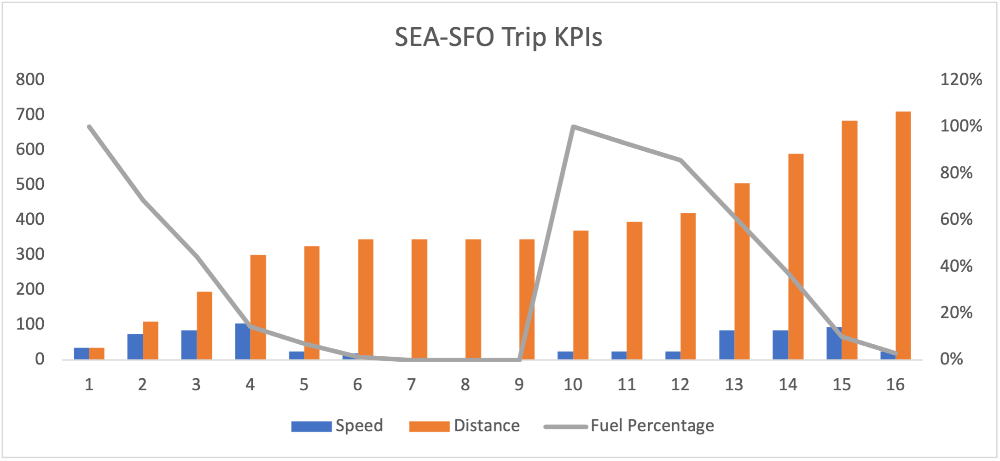
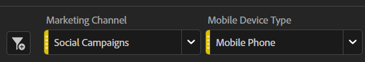

# Lograr el éxito con los paneles de resumen ejecutivos

_Los ejecutivos a menudo carecen de información relevante y oportuna para sus sitios y aplicaciones, y dependen de gráficos mensuales de Excel o se ahogan en datos granulares. La solución: tablero de resumen ejecutivo._

Quiero que imaginen conducir desde Seattle a San Francisco. En la dirección, es bastante fácil. Sube a la I-5 Sur por doce a dieciséis horas y estás allí. Simple, ¿verdad? Ahora, quiero que imaginen que he puesto un trozo de cartón sobre su tablero, y les digo que al final de su viaje, recibirán un tablero que les dice que su velocidad, niveles de combustible y distancia recorrieron:

Si examina el gráfico, puede observar algunas cosas:

1. Su velocidad varió mucho, muy por encima del límite de velocidad legal en algunos puntos, y muy bajo en otros puntos debido a cosas como el tráfico de Portland

1. La distancia recorrida es estática durante las horas 6-9

1. Esto se debe a que su combustible cayó al 0% y usted tuvo que esperar a la asistencia en la carretera para pasar por el tráfico de Portland y recargar su tanque de gas

Un viaje así obviamente sería miserable, impredecible y peligroso.
No es la manera de conducir. Necesita información continua sobre la velocidad, la distancia recorrida y los niveles de combustible para realizar ajustes continuos en la forma de conducir. Sin duda, una persona razonable arrancaría el cartón del tablero y lo chequearía regularmente, lo que le ahorraría horas de viaje, casi eliminaría el riesgo de quedarse sin gasolina y le mantendría moviendo a la velocidad correcta para evitar un boleto de mayor velocidad.

Entonces, ¿por qué tantos ejecutivos aceptan esto como una manera razonable de ejecutar sus sitios y aplicaciones?

Muchos ejecutivos no tienen acceso a la información relevante y continua necesaria para tomar medidas de manera oportuna. En su lugar, reciben una cubierta una vez al mes con estadísticas exportadas de Adobe Analytics a Excel, graficadas y luego incorporadas a PowerPoint. Si se produce un punto de inflexión a principios de mes, no lo sabrán hasta principios del mes siguiente, mucho después de que puedan hacer preguntas o tomar medidas.
Las alertas personalizadas también son una buena opción, pero todos sabemos cómo se ve la bandeja de entrada de correo electrónico de un exec.

Pero los ejecutivos también están muy ocupados. Imaginen que hicieron el mismo viaje, pero en lugar del tablero limpio que tienen en su auto, no solo tenían su nivel de combustible, cuentakilómetros y velocímetro, sino también dos docenas de metros más que les daban datos increíblemente granulares sobre todo, desde los niveles de líquido limpiaparabrisas hasta la duración estimada de sus filtros de aceite.
Sería demasiado, demasiado específico, demasiado especializado.

Se quiere que los ejecutivos tengan datos suficientes para saber cuándo se necesita su atención de inmediato, no tanto que se arrojan las manos frustrados. Si va a un mensaje del propietario de un producto o del administrador de marketing que un exec quiere saber sobre una anomalía, le va a gustar.

Aquí es donde el panel de resumen ejecutivo aparece como el medio feliz. La mayoría de los ejecutivos tienen unos tres KPI que les preocupan profundamente. En el comercio minorista, pueden ser pedidos, ingresos y AOV. Para B2B, posibles clientes, calidad de posible cliente y tasa de conversión. Los servicios pueden estar interesados en visitas, citas y visitantes de retorno. Sean cuales sean los tres, ponlos en números grandes y audaces con un cambio de año tras año y un gráfico. La visualización Resumen de métricas clave facilita este proceso:

Agregue datos históricos para estas mismas tres métricas para que sea fácil ver las tendencias a largo plazo:

Agregue un par de desplegables para lo que sea importante para su organización. Encuentro que el tipo de dispositivo y el canal de marketing son generalmente buenas apuestas:

Estas son importantes en general, pero como siempre, asegúrese de que lo que elija sea relevante para su sitio o aplicación.

Finalmente, en la parte inferior, añada algunos detalles. Encuentro que el rendimiento de la página a menudo es popular entre los ejecutivos, pero la clave es que está por debajo del pliegue.
Pueden buscarlo si lo desean, pero de lo contrario, tienen los datos que necesitan para hacer preguntas de inmediato:

Con este producto final en mano, solo necesita:

- Capacite a sus ejecutivos sobre cómo leerlo

- Capacitarlos sobre cómo usar los filtros

- Capacitarles sobre cómo realizar un desglose básico

- Consigue un poco de café y prepárate, porque después de que estén empoderados con los datos, los ejecutivos vendrán a ti con muchas preguntas

En conclusión, los tableros resumidos ejecutivos ofrecen información constante y pertinente para la adopción oportuna de decisiones. Los recuadros mensuales con gráficos de Excel son insuficientes y proporcionar demasiados datos granulares puede abrumar a los ejecutivos. Un medio feliz es centrarse en los tres KPI más importantes con datos históricos y desplegables para factores relevantes. Al capacitar a los ejecutivos sobre cómo utilizar el panel, pueden tomar decisiones informadas y hacer preguntas. Los tableros de resumen ejecutivos pueden mejorar el rendimiento del sitio y la aplicación, así como impulsar el éxito.

## Autor

Este documento fue escrito por:

**Gitai Ben-Ammi**, Consultor principal en Concentrix Catalyst

Campeona de Adobe Analytics
