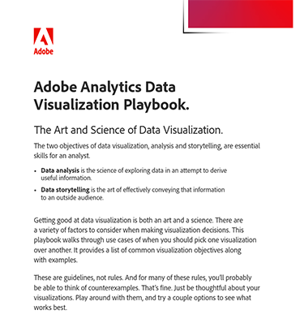

# Guía de visualización de datos de Adobe Analytics

La visualización de datos es tanto un arte como una ciencia, que requiere una cuidadosa consideración de varios factores. Para ayudar a navegar por algunas de estas decisiones, hemos creado el Libro de estrategias de visualización de datos.

[Descargar](assets/adobe-analytics-data-visualization-playbook.pdf) el manual de visualización de Adobe Analytics

Tanto si aborda preguntas comerciales comunes como si profundiza en análisis complejos, este completo manual analiza una serie de casos de uso que demuestran cuándo y cómo utilizar las diferentes visualizaciones de forma eficaz.

## Autor

Este documento ha sido creado por David Geist,
asesor comercial de data and insights en Adobe.
