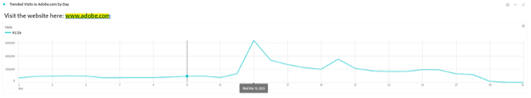

# Más que palabras: Uso de visualizaciones de texto y descripciones en Analysis Workspace

Como usuario de Adobe Analytics Analysis Workspace, es natural que su enfoque vaya a menudo a sus datos y visualizaciones de datos. ¿Alguien puede escribir un resumen, verdad? Sin embargo, ignorar las funciones de Analysis Workspace, como la visualización de texto o las descripciones de visualización, puede significar perder una valiosa oportunidad para combinar sus perspectivas con texto, imágenes, gif y vínculos valiosos. Al proporcionar referencias y más contexto para informar a los usuarios sobre lo que significan sus datos, puede hacerlo más eficaz e impactante.

En primer lugar, asegúrese de saber dónde puede encontrar estas funciones:

- Para añadir o modificar la Descripción de una visualización, simplemente haga clic con el botón derecho en el área superior del elemento y seleccione el vínculo &quot;Editar descripción&quot;:

   

- Para agregar un panel de texto independiente, haga clic en el menú Visualizaciones de la barra de navegación izquierda:

   

Aunque esta guía muestra un ejemplo utilizando uno de estos dos métodos, puede realizar adiciones similares en descripciones y visualizaciones de texto. También puede ajustar el tono de fuente, la alineación, el color y crear listas con viñetas o números:

Empecemos. Un contexto muy útil para agregarlo a cualquier proyecto de Analysis Workspace es un hipervínculo: puede incluir vínculos a la dirección URL de la página detallada en el informe, vínculos a otros proyectos de Analysis Workspace, páginas de contexto de informes externos o cualquier otra cosa que pueda resultar útil cuando visualice el informe. Se puede acceder a esta función seleccionando cualquier parte del texto y el icono &quot;vínculo&quot;:

Como resultado, cualquier persona que vea el proyecto de Analysis Workspace puede acceder a cualquier página accesible en línea o en la intranet de su organización con un solo clic:

Ahora, si prefiere incluir el contenido directamente en el informe, puede utilizar un vínculo de imagen para colocar el contenido junto con los datos:

Puede agregar una imagen accesible en cualquier dirección URL pública al informe, siempre y cuando la dirección URL esté en *https* y tiene el formato .png, .jpeg, .jpg o .gif; aunque esto puede parecer restrictivo, cualquier herramienta en línea utilizada para compartir imágenes o GIF como imgur o GIPHY puede proporcionar un método rápido para cargar archivos accesibles desde Workspace mediante un vínculo compartido.

¿El resultado? Puede mostrar la página web a la que hacen referencia los datos directamente en el proyecto:

También puede utilizar GIF en sus proyectos para incluir imágenes en movimiento como el recorrido por un sitio, la ruta ideal a través de su sitio o una tarea en su aplicación, o simplemente mostrar a su equipo cómo ***alucinante*** los informes se han convertido en:

## Autor

Este documento fue escrito por:

**Dan Cummings**, jefe de análisis de ingeniería de productos senior en McDonald&#39;s Corporation

Campeona de Adobe Analytics

