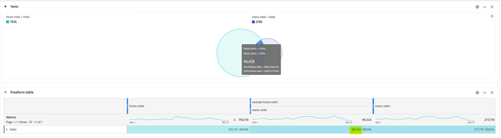
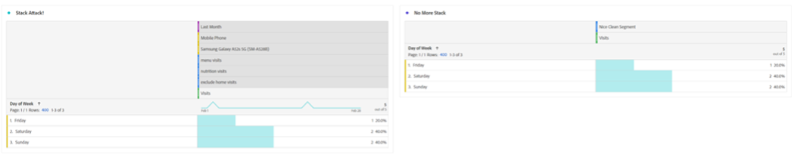

# Espere un segmento... Utilizando segmentos para descubrir nuevas perspectivas en Analysis Workspace.

Tanto si es un nuevo usuario de Adobe Analytics como un experto profesional, aprovechará los segmentos un poco en sus proyectos de Analysis Workspace. Como [Adobe Experience League](https://experienceleague.adobe.com/docs/analytics/components/segmentation/seg-overview.html?lang=es) describe, &quot;los segmentos le permiten identificar subconjuntos de visitantes en función de sus características o de las interacciones con el sitio web&quot;. Aunque el resultado básico de esta función consiste en aislar grupos de usuarios, visitas o visitas individuales al sitio, un analista afilado como usted puede ser creativo con esta herramienta y encontrar nuevas formas de obtener información sobre la actividad del sitio. La lista de opciones posibles es amplia, así que no dude en intentar crear las suyas y compartirlas con otros en su organización o en línea en comunidades como la [Comunidad de Adobe Analytics](https://experienceleaguecommunities.adobe.com/t5/adobe-analytics/ct-p/adobe-analytics-community?profile.language=es) en el Experience League o en el [#Slack de medida](https://www.measure.chat/) comunidad.

Si necesita un repaso rápido sobre cómo crear un segmento, consulte la documentación del Experience League sobre el uso de la variable [Generador de segmentos](https://experienceleague.adobe.com/docs/analytics/components/segmentation/segmentation-workflow/seg-build.html?lang=en) en Analysis Workspace.

## Comparación y contraste de segmentos

En Analysis Workspace, puede comparar dos segmentos utilizando &quot;[Comparación de segmentos](https://experienceleague.adobe.com/docs/analytics/analyze/analysis-workspace/panels/segment-comparison/segment-comparison.html?lang=es)&quot;. La comparación de segmentos se encuentra en la sección Paneles de la barra de navegación izquierda:

Sin embargo, a veces no necesita un panel de comparación completo para llevar las perspectivas de clave principal a los usuarios finales. Afortunadamente, algunas características también se pueden comparar en un panel estándar.

La variable [Visualización de diagrama de Venn](https://experienceleague.adobe.com/docs/analytics/analyze/analysis-workspace/visualizations/venn.html?lang=es) puede ayudar a crear una comparación rápida, que le permita pasar el ratón por encima y ver las sesiones, pedidos, usuarios, etc. superpuestos. entre 2 y 3 segmentos personalizados. También puede generar rápidamente segmentos haciendo clic con el botón derecho en cualquiera de las secciones superpuestas:

A veces, la información importante no está en los datos superpuestos, sino en los datos que no se superponen. Una forma rápida de verlo es crear una copia de un segmento y convertirlo en un segmento &quot;Excluir&quot;:

Al apilar el segmento &quot;excluir&quot; con el otro segmento de la comparación, ahora puede calcular rápidamente cuántas visitas han llegado a la página de menú sin ver también la página principal en la misma sesión:

## Ataque de pila

Del mismo modo, puede crear los datos de intersección de un diagrama de Venn apilando cualquier segmento. No hay límite en cuanto a la cantidad de segmentos o dimensiones individuales que apila. Por ejemplo, si quería averiguar rápidamente qué Días de la semana del mes pasado mi sitio tuvo una visita en un teléfono móvil, específicamente una Samsung Galaxy A52, que vio mis páginas de menú y nutrición, pero NO vio mi página de inicio, puedo crearla rápidamente sobre la marcha de esta manera:

Pero aún mejor, una vez que encuentro ese subconjunto perfecto de mi base de usuarios o visitas, puedo seleccionar todos esos valores, hacer clic con el botón derecho y crear un segmento instantáneamente:

Eso es mucho poder en un segmento.

## Un segmento de números para un número de segmentos

Muchos usuarios suelen observar los valores nominales, ordinales o de intervalo al crear segmentos, como una página visitada, un intervalo de edad de los usuarios o el número de visitas que un usuario ha realizado en el pasado. Sin embargo, también puede usar datos de proporción al crear un segmento agrupando estos valores, ya sean dimensiones estándar, métricas estándar o variables y métricas personalizadas para su organización.

Por ejemplo, Tiempo empleado en la página o Tiempo empleado por visita tiene bloques pregenerados disponibles:

Sin embargo, es posible que estas visitas no siempre se ajusten a las necesidades de la organización, quizás la mayoría de las visitas del sitio se realicen en menos de 10 minutos. Puede utilizar la medición granular para crear bloques de tamaño diferente. Aquí hay uno creado para ver las visitas que duran entre 1 minuto, 1 segundo y 1 minuto, 30 segundos:

Una vez creado, ahora puedo empezar a ver mis visitas, pedidos y otros eventos por los diferentes grupos de tiempo agrupados que he personalizado:

Incluso puede empezar a examinar cómo cambian los indicadores de rendimiento clave (KPI) como factor de tiempo que un usuario emplea, cuántas páginas ha visitado en una visita, cuántas veces ha visitado en el pasado o cualquier otro valor numérico, lo que básicamente le permite observar una métrica como un factor de otra métrica:

Las posibilidades de utilizar segmentos para encontrar nuevas perspectivas son infinitas. Esto es simplemente un punto de partida. Pruebe por su cuenta y comunique a la comunidad lo que descubre: [Comunidad de Adobe Analytics](https://experienceleaguecommunities.adobe.com/t5/adobe-analytics/ct-p/adobe-analytics-community?profile.language=es) en el Experience League o en el [#Slack de medida](https://www.measure.chat/) comunidad.

¡Feliz segmentación!

## Autor

Este documento fue escrito por:

**Dan Cummings**, jefe de análisis de ingeniería de productos senior en McDonald&#39;s Corporation

Campeona de Adobe Analytics

