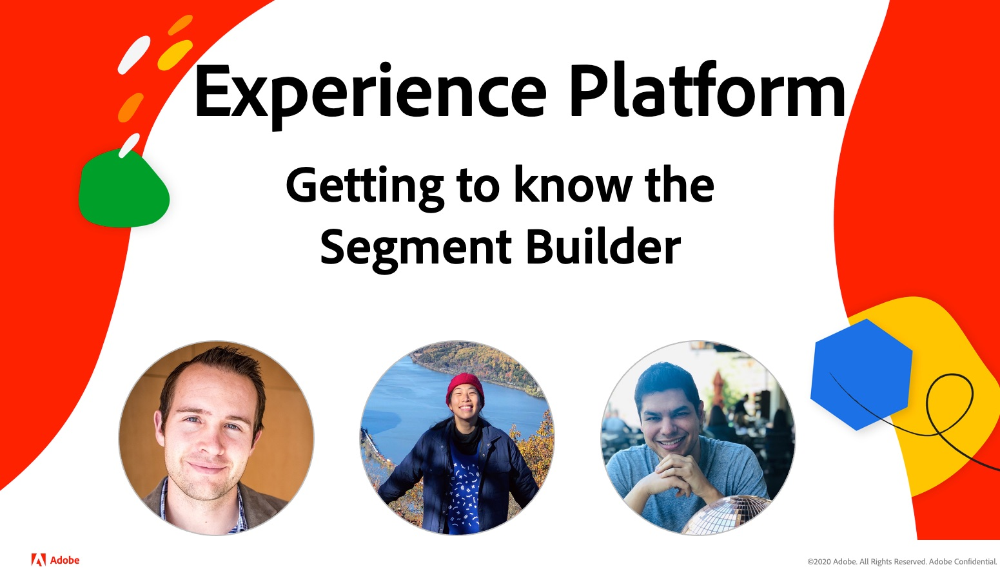

# Experience League ACTIVO

Experience League LIVE es un programa de transmisión en directo producido por el equipo Experience League y le ofrece consejos, trucos y estrategias útiles que puede aplicar en aplicaciones de Experience Cloud, servicios de aplicaciones y Adobe Experience Platform.

## Episodio siguiente: Experience Platform y CDP en tiempo real!

*episodeInvitados:* Aaron Shields, Yaya Wang, Andres Monroy 
***MARK THE DATE!*** El jueves 26 de  **agosto** que las  **9** amPacific Time

## Próximos episodios

¡Estén entusiasmados con los próximos episodios de Experience League LIVE!

<table>
<tr>
  <td>
    
  </td>
  <td>
    <strong></strong>
  </td>
  <td>
    <strong></strong>
  </td>
</tr>
<tr>
  <td>
    <strong>Aplicación: </strong> Adobe  
    <strong>Fecha de campaña: </strong> septiembre de 2021 
    <strong>Tema: </strong>  
    <strong>TBDGuests:</strong> TBD
  </td>
  <td>
    <strong>Aplicación: </strong> Adobe Experience  
    <strong>ManagerFecha:</strong> Oct 2021 
    <strong>Tema: </strong>  
    <strong>TBDGuests:</strong> TBD
  </td>
  <td>
    <strong>Aplicación: </strong> Adobe Experience  
    <strong>PlatformDate: </strong> noviembre de 2021 
    <strong>Tema: </strong>  
    <strong>TBDGuests:</strong> TBD
  </td>
</tr>
</table>

## Reproducciones de episodios anteriores

¿Perdiste un episodio de Experience League LIVE? Te perdonamos. Aquí hay vínculos para que pueda ver episodios anteriores.

<table>
<tr>
  <td>
     
    <b>Host: </b> <i></i> 
    <b>DougInvitados: </b> <i>Eric Matisoff y Dasha </i> 
    <b>FitzpatrickAired:</b> <i>29 de julio de 2021</i>

</td>

</tr>

</table>

>[!TIP]
>
>Para métodos adicionales de aprendizaje, consulte nuestros [cursos](https://experienceleague.adobe.com/#dashboard/learning) gratuitos, así como tutoriales [individuales](https://experienceleague.adobe.com/docs/home-tutorials.html).
