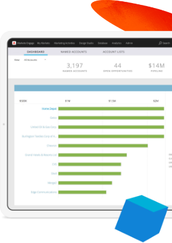

# Experience League LIVE

## Únete a nosotros para el próximo episodio !

Experience League LIVE es un programa de transmisión en vivo producido por el equipo Experience League.  Es una oportunidad para conectarse con expertos en productos de Adobe y aprender consejos, trucos y estrategias útiles que puede aplicar con las aplicaciones de Adobe Experience Cloud.

## ¡Próximos eventos en directo del Experience League!

<table>
<tr>
  <td>
      
     

          <strong>Recorridos del cliente</strong>
     

     

          <em>Septiembre de 2021</em>
     

    

    <em>Obtenga información de los expertos en productos sobre cómo crear experiencias que se adapten a los clientes en tiempo real</em>
    

  </td>
  <td>
      
     

          <strong>Content and Commerce de </strong>
     

          <em>Octubre de 2021</em>
     

     

    

    <em>Aprenda a crear y administrar contenido a escala y a crear experiencias de comercio personalizadas</em>
    

  </td>
  <td>
      
     

          <strong>Experience Platform</strong>
     

     

          <em>Diciembre de 2021</em>
     
    
    

    <em>Obtenga información de los expertos en productos sobre cómo crear experiencias que se adapten a los clientes en tiempo real</em>
    

  </td>
</tr>
</table>

## Episodios anteriores

¿Se ha perdido algún episodio de Experience League LIVE? Le perdonamos. ¡Echa un vistazo a nuestros episodios pasados!

<table>
<tr>

<td>
    
     

          <strong>Invitados</strong> :  <i>Eric Matisoff y Dasha Fitzpatrick</i>
     

     

          <em>29 de julio de 2021</em>
     
    
    

    <em></em>
    

  </td>
</tr>
</table>

>[!TIP]
>
>Para descubrir métodos adicionales de aprendizaje, consulte nuestros [cursos](https://experienceleague.adobe.com/#dashboard/learning) gratuitos, así como los [tutoriales](https://experienceleague.adobe.com/docs/home-tutorials.html?lang=es) individuales.
