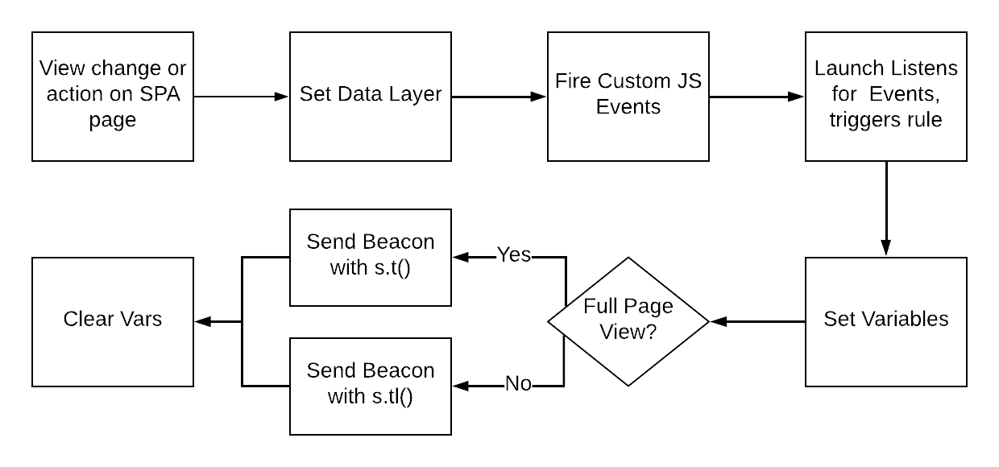
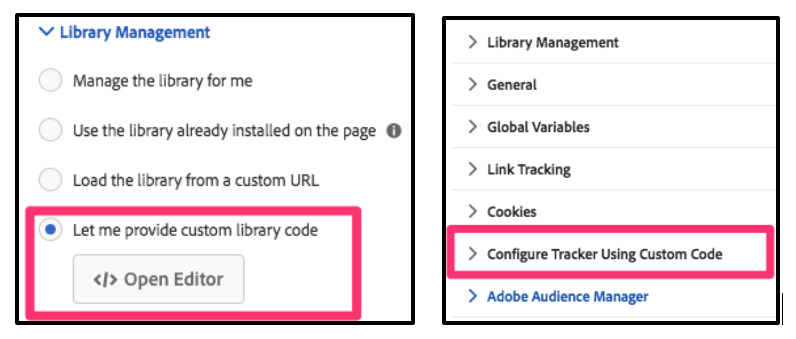

# Prácticas recomendadas de implementación para aplicaciones de una sola página (SPA) {#implementation-best-practices-for-single-page-appliations}

Conozca algunas prácticas recomendadas para implementar [!DNL Adobe Analytics] en aplicaciones de una sola página (SPA). Esto incluye el uso de [!DNL Experience Platform Tags], el método de implementación recomendado.

NOTAS INICIALES:

* El contenido siguiente hace referencia al uso de [!DNL Experience Platform Tags] para implementar Adobe Analytics en un sitio. Estas consideraciones se aplican si no se utiliza [!DNL Experience Platform Tags], por lo tanto, debe adaptarlas al método de implementación.
* Existen diferencias en las SPA, así que debe ajustar el enfoque en consecuencia para satisfacer mejor sus necesidades.

## Diagrama sencillo del trabajo con las SPA en [!DNL Experience Platform Tags] {#simple-diagram-of-working-with-spas-in-tags}



**NOTA:** Este es un diagrama simplificado de cómo se gestionan las páginas de SPA en una implementación de Adobe Analytics mediante [!DNL Experience Platform Tags]. En las secciones siguientes se identifican los pasos y los problemas que se deben tener en cuenta.

## Configuración de la capa de datos {#set-the-data-layer}

Cuando se carga contenido nuevo o se produce una acción en una página de una SPA, *actualice primero la capa de datos*. Esto debe suceder **antes** de un evento personalizado que active la ejecución de una regla en [!DNL Experience Platform Tags]. Esto garantiza que los valores correctos de la capa de datos se inserten en las etiquetas y, a continuación, en Adobe Analytics.

La siguiente es una capa de datos de muestra. Cualquiera de estos elementos puede cambiar según la vista inicial o el cambio posterior de la vista, dado que se ha realizado una acción en la página de su SPA. Por ejemplo, en un cambio de vista completo o mayoritario, es un requisito común pasar un valor “[!DNL pageName]” único para diferenciar entre las vistas de la creación de informes de Adobe Analytics.

```JavaScript
<script>
    digitalData = {
        pageInstanceID: "Launch Demo Site",
        page:{
            pageInfo:{
                pageID: '2745374',
                pageName: 'acs demo - product listing page'
            },
            attributes:{
                project: "Experience Platform Launch Project"
            }
        },
        user : [ {
          "profile" : [ {
            "attributes" : {
              "gender" : "male",
              "age" : "35"
            }
          } ]
        }],
        libraries : {
          adobe : {
            launch : {
              state : 0, // 0 = not loaded , 1 = loaded
              domain : "assets.adobedtm.com"
            }
          }
        }

     };
    </script>
```

## Configuración de eventos personalizados y escucha de estos en [!DNL Experience Platform Tags] {#setting-custom-events-and-listening-in-tags}

Cuando se carga contenido nuevo o se produce una acción en la página de la SPA, se debe informar a las etiquetas de Experience Platform para que ejecuten una regla que envíe datos a [!DNL Analytics]. Hay un par de enfoques para esto: [!UICONTROL Reglas de llamada directa] o Eventos personalizados.

* [!UICONTROL Reglas de llamada directa]: configure una [!UICONTROL regla de llamada directa] que se ejecuta cuando se la llama directamente desde la página. Si la carga o la acción de la página es simple o única y puede ejecutar un conjunto específico de instrucciones cada vez (por ejemplo, configurar [!DNL eVar4] en X y activar [!DNL event2] cada vez), este enfoque es adecuado. Consulte la documentación de [!DNL Experience Platform Tags] para obtener más información acerca de la creación [!UICONTROL reglas de llamada directa].
* Eventos personalizados: si necesita adjuntar dinámicamente una carga útil con valores únicos para los eventos que se producen en páginas de SPA, utilice eventos de JavaScript personalizados y escúchelos en [!DNL Experience Platform Tags]. Utilice la carga útil para establecer elementos de datos y variables de Analytics en Etiquetas. Este método se considera una práctica recomendada, ya que esta necesidad suele prevalecer para las SPA. Nuestros ejemplos siguientes utilizan el método de eventos personalizados.

**Ejemplos:** [en este](https://experienceleague.adobe.com/docs/experience-manager-learn/sites/spa-editor/spa-editor-framework-feature-video-use.html?lang=es) documento de ayuda, hay vínculos a sitios de SPA de muestra que implementan [!DNL Analytics] y otras soluciones de Experience Cloud. En estos ejemplos, se emplean los siguientes eventos personalizados:

* **[!DNL Event-view-start]**: ejecutar al inicio de la vista de vista/estado que se carga.
* **[!DNL Event-view-end]**: ejecutar cuando se produce un cambio de vista/estado y todos los componentes SPA de la página terminan de cargarse. Este es el evento que suele enviar datos a Adobe Analytics.
* **[!DNL Event-action-trigger]**: ejecutar cuando se produce cualquier evento en la página, excepto la carga de vista/estado. Ejemplos de esto son un evento de clic o un cambio de contenido menor sin un cambio de vista.

Consulte las páginas y los documentos a los que se hace referencia arriba para obtener más información acerca de cómo y cuándo se activan estos eventos. No es necesario que utilice los mismos nombres de evento en la implementación. El caso de uso funcional del método usado es esencial para entenderlo como la mejor práctica recomendada para cada uno. El siguiente vídeo presenta una página de SPA y código de muestra en [!DNL Experience Platform Tags] que escucha los eventos personalizados.

>[!VIDEO](https://video.tv.adobe.com/v/23024/?quality=12&learn=on)

## Ejecución de s.t() o s.tl() en [!DNL Experience Platform Tags] {#running-s-t-or-s-tl-in-the-launch-rule}

Un concepto importante a entender de [!DNL Analytics] al trabajar con una SPA es la diferencia entre `s.t()` y `s.tl()`. El código activa uno de estos métodos en [!DNL Experience Platform Tags] para enviar datos a [!DNL Analytics].

* **s.t()**: la “t” significa “track” (seguimiento) y representa una vista de páginas. Si la vista cambia lo suficiente como para que *considere* que es una nueva “página”, emplee esta llamada. Establezca un valor único en la variable [!DNL s.pageName] y use `s.t()` para enviar los datos a [!DNL Analytics].

* **s.tl()**: “tl” significa “track link” (vínculo de seguimiento) y representa un clic en vínculo o un pequeño cambio en el contenido. Si el cambio de vista es mínimo, utilice `s.tl()` para pasar un valor único acerca de la interacción a [!DNL Analytics]. Esta variable transferida no es [!DNL s.pageName], ya que esto se ignora en Analytics cuando se reciben las llamadas de `s.tl()`.

**SUGERENCIA:** Como guía general, si la pantalla cambia en más del 50 %, utilice la llamada de vista de páginas `s.t()`. De lo contrario, use `s.tl()`. Sin embargo, aplique su criterio a la hora de considerar las acciones que constituyen una nueva “página” y cómo deben presentarse en los informes de Adobe Analytics.

El siguiente vídeo muestra dónde y cómo activar `s.t()` o `s.tl()` en Etiquetas.

>[!VIDEO](https://video.tv.adobe.com/v/23048/?quality=12&learn=on)

## Borrar variables {#clear-variables}

Envíe los datos correctos a [!DNL Analytics] en el momento adecuado. En un entorno de SPA, un valor almacenado en una variable [!DNL Analytics] persiste y se reenvía a [!DNL Analytics], potencialmente cuando ya no lo desea. Existe una función en la extensión [!DNL Tags] [!DNL Analytics] para borrar las variables y garantizar que la siguiente llamada no envíe datos de forma errónea a [!DNL Analytics].

El diagrama anterior muestra las variables borradas *después* de que envíe los datos. En realidad, esto puede suceder antes O después de la llamada, sin embargo, sea coherente en sus reglas de [!DNL Experience Platform Tags] para lograr una implementación más limpia. Si borra las variables *antes* de ejecutar `s.t()`, configure las nuevas inmediatamente después de la llamada de y, a continuación, proceda a enviar los nuevos datos a [!DNL Analytics].

**NOTA:** No siempre es necesario borrar variables al ejecutar `s.tl()`. Esta llamada requiere el uso de la variable [!DNL linkTrackVars] para indicar a [!DNL Analytics] qué variables se van a establecer. Esto sucede automáticamente en [!DNL Experience Platform Tags] mediante la configuración. Evita que las variables erróneas se configuren en contraste con el comportamiento con llamadas de `s.t()` en un entorno de SPA. Para garantizar una implementación lo más limpia y fiable posible, es probable que sea más fácil emplear la función de borrar variables para ambas llamadas en un entorno de SPA.

El siguiente vídeo muestra dónde y cómo borrar variables en [!DNL Tags].

>[!VIDEO](https://video.tv.adobe.com/v/23049/?quality=12&learn=on)

## Consideraciones adicionales {#additional-considerations}

### Ventanas de código personalizado en [!DNL Experience Platform Tags] {#custom-code-windows-in-tags}

En la extensión [!DNL Tags] [!DNL Analytics], hay dos lugares donde se puede insertar código personalizado: las secciones [!UICONTROL Administración de la biblioteca] y [!UICONTROL Configurar el rastreador mediante código personalizado].



Cualquiera de estas ubicaciones ejecuta el código contenido una vez para la carga inicial de la página de SPA. Si el código debe ejecutarse en una vista o cambio de acción, impleméntelo en la **[!UICONTROL regla]** adecuada (por ejemplo la regla, “carga de página: event-view-end”) para garantizar que el código se ejecute cada vez que se ejecute la [!UICONTROL regla]. Al crear esa acción en la [!UICONTROL regla], establezca *Extensión = Principal* y *Tipo de acción = Código personalizado*.

### Sitios “híbridos” de páginas tradicionales y SPA {#hybrid-spa-and-traditional-sites}

Algunos sitios están compuestos por una combinación de páginas tradicionales y SPA. En este caso, utilice una estrategia que funcione para ambos tipos de página. Al configurar los eventos personalizados del sitio y activar las reglas en [!DNL Experience Platform Tags], asegúrese de que las visitas dobles no se envíen a [!DNL Analytics] en función de cambios de hash, etc. En este caso, suprima una de las vistas de página para evitar que se pasen datos duplicados a Adobe Analytics.

Si decide separar la funcionalidad en [!UICONTROL reglas] únicas para obtener más control, recuerde documentarlo cuando lo haga. Si cambia una [!UICONTROL regla], realice el mismo cambio en la otra [!UICONTROL regla].

### Integración con [!DNL Target] a través de A4T {#integration-with-target-using-a4t}

Al integrar con [!DNL Target] mediante A4T, confirme que las solicitudes [!DNL Target] y [!DNL Analytics] enviadas en la misma vista o acción pasan el mismo valor de parámetro SDID. Esto garantiza que los datos se sincronicen correctamente en el back-end.

Para ver estas visitas, utilice un depurador o una herramienta de monitorización de paquetes. Adobe proporciona Experience Platform Debugger para este fin. Es una extensión de Chrome que puede [descargarla aquí](https://chrome.google.com/webstore/detail/adobe-experience-platform/bfnnokhpnncpkdmbokanobigaccjkpob?hl=es). [!DNL Target] debe ejecutarse primero en la página. Esto también se puede comprobar en el depurador.

## Recursos adicionales {#additional-resources}

* [Debate SPA en los foros de Adobe](https://experienceleaguecommunities.adobe.com:443/t5/adobe-experience-platform-launch/best-practices-for-single-page-apps/m-p/267940)
* [Sitios de arquitectura de referencia para mostrar cómo implementar SPA en Experience Platform Launch](https://experienceleague.adobe.com/docs/experience-manager-learn/sites/spa-editor/spa-editor-framework-feature-video-use.html?lang=es)
