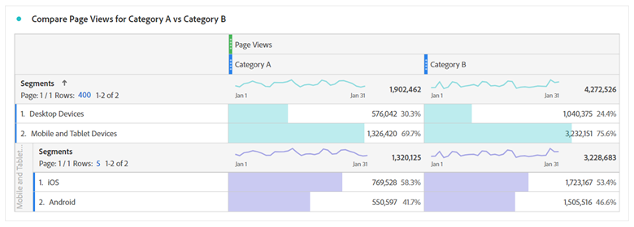
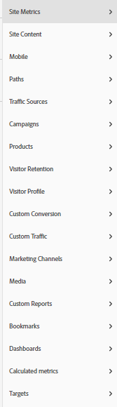

# Guía completa para la transición de Google Analytics a Adobe Analytics

## 1. Introducción

Uno de los mayores desafíos en la transición entre cualquier herramienta es aprender dónde encontrar una funcionalidad equivalente y aprender a utilizarla de manera eficiente. Esta conversación forma parte de una guía más amplia para ayudar a los usuarios a realizar la transición a Adobe Analytics (como nuevo usuario o como proveniente de Google Analytics) con mayor facilidad. una comparación detallada con GA; como la herramienta comparativa más probable con la que la mayoría de los usuarios estarán familiarizados; se proporciona para ayudar a los usuarios a correlacionar los conocimientos existentes con el nuevo conjunto de herramientas. Aunque no hay sustituto para la práctica; esto le ayudará a empezar y, con suerte, reducirá las frustraciones que pueda encontrar durante este tiempo (o incluso como un actualizador después de empezar a entrar en la oscilación de las cosas).

También deberíamos hacer una rápida comparación terminológica:

| **Descripción** | **Adobe Analytics** | **Google Analytics** |
|--------------------------------------------------------------------------------------------------------------------------------|---------------------|----------------------|
| Se ha visto una métrica de evento que representa una página (o pantalla de una aplicación). | Vista de la página | Vista de página. |
| Una métrica que representa un grupo de interacciones en su sitio web o aplicación que se producen en el mismo intervalo de tiempo | Visita | Sesión |
| Una métrica que define un dispositivo identificado (en función de varios criterios, incluidas las cookies y otros patrones de comportamiento, para unir información del usuario) | Visitante único | Usuario |

## 2. Las interfaces

Una de las cosas que veo más a menudo cuando la gente compara Adobe Analytics y los Google Analytics es que el Adobe tiene mucho en curso - es desalentador para la gente. Esto es cierto, pero también lo es; créelo o no; una fortaleza, no una debilidad. Adobe proporciona una amplia gama de herramientas y flexibilidades en la visualización de datos, lo que le permite tener mucha más libertad para construir lo que necesita.

Empecemos por ver los informes &quot;en el sitio&quot;.

### 2.1. Informes in situ

#### 2.1.1. Pantalla principal

Tanto Adobe Analytics como los Google Analytics permiten personalizar la primera vista que ve un usuario cuando inicia sesión.

##### 2.1.1.1. Workspace / Pantalla principal de conjunto personalizado (Adobe Analytics)

Adobe Analytics no presume de crear un informe creado previamente para que todos los usuarios lo vean en el inicio de sesión. La página de inicio predeterminada lleva al usuario a la pantalla de aterrizaje de Workspace, que mostrará a cada usuario todos los informes de espacio de trabajo que ha creado o ha compartido con él. Además, cada usuario tiene la capacidad de establecer cualquiera de estos informes como su pantalla de inicio si así lo desea.

Más adelante en esta guía se mostrarán más detalles sobre Workspace. Véase la sección 2.1.2.1

>[!TIP]
>
>Cree o comparta algunos informes estándar para su organización de modo que tengan un punto de partida para ver la información sin tener que sumergirse en la creación de sus propios informes de inmediato.

##### 2.1.1.2. Perspectivas de la pantalla de inicio (Google Analytics)

* La pantalla de inicio de Google Analytics tiene algunas visualizaciones prediseñadas para usted.  Estas cubren cosas como:
* Usuarios, sesiones, tasa de devoluciones y duración de la sesión en los últimos 7 días
* Usuarios por hora del día en los últimos 30 días
* Usuarios actuales en este momento y Páginas activas principales
* Canal de tráfico, fuente/medio y referencias en los últimos 7 días
* Sesiones por país en los últimos 7 días
* Páginas principales de los últimos 7 días
* Tendencia de usuarios activos durante los últimos 30 días
* y más

En GA4, los usuarios tienen más opciones para personalizar y agregar sus propios informes a la pantalla principal.

Esto es probablemente lo que más te perderás cuando vayas al Adobe. no tienen una pantalla de inicio de este tipo prediseñada para usted, pero puede configurar fácilmente un espacio de trabajo personalizado para replicar lo que necesita de lo anterior y, si lo desea, establecerla como pantalla de aterrizaje. Más adelante (o consulte la sección 2.1.2.1 del espacio de trabajo del Adobe).

#### 2.1.2. Report Builder en el sitio

Además de los informes simples que proporcionan las herramientas de análisis, cada herramienta también proporciona herramientas más potentes para crear sus propios informes personalizados.

##### 2.1.2.1. Espacio de trabajo de Adobe Analytics

Este es el centro de Adobe Analytics, ya que se introdujo en 2017 y se ha convertido en el centro de análisis de Analytics, y la razón principal por la que la sección Informes pronto dejará de funcionar.

Esta herramienta le permite crear informes con una libertad casi completa.

El informe se puede desglosar en paneles y esos paneles pueden contener cualquier cantidad de visualizaciones. Los paneles se pueden configurar como información común, como intervalo de fechas y filtros de segmento comunes.

Se puede cambiar el tamaño de los paneles y las visualizaciones que los rodean y arrastrarlos para mostrar los elementos juntos o apilados. Si desea comparar dos grupos diferentes de datos uno al lado del otro, puede crear paneles que dividan 50/50 en el medio mostrando los dos sitios uno al lado del otro para facilitar la comparación.

Los usuarios tienen a su disposición una multitud de visualizaciones:

* Tabla improvisada
* Tabla de cohorte
* Abandono
* Flujo
* Gráficos
   * Área (apilada y sin apilar)
   * Líneas
   * Disperso
   * Barra (apilada y sin apilar)
   * Viñeta
   * Anillo
   * Histograma
   * Barras horizontales (apiladas y sin apilar)
* Mapa
* Bloques de resumen
   * Cambio de resumen
   * Texto de resumen
   * Texto (campo de texto libre para introducir información adicional para dar contexto)
* Venn

Cada panel y visualización puede tener título y se le puede aplicar una descripción para ayudar a contextualizar lo que muestra la información.
En Adobe, los segmentos (esencialmente los filtros de datos) se aplican de forma retroactiva, y estos se pueden extraer en columnas de las tablas improvisadas para comparar los datos en paralelo. Por ejemplo, si un usuario quería comparar dos categorías diferentes en el sitio para el tráfico; podrían crear un segmento para la &quot;categoría A&quot; y otro para la &quot;categoría B&quot;.

Las tablas improvisadas permiten varias columnas y segmentación, según sea necesario, para visualizar los datos como desee.

A partir de lo anterior, ¿no desea ver un desglose por fecha? Basta con arrastrar y soltar otra dimensión o segmento para ver los datos de una manera diferente... como quizá usar segmentos para el tipo de dispositivo y, a continuación, agregar un desglose por sistema operativo para los usuarios de Mobile/Tablet:

Workspace permite volar su creatividad, no se limita a desgloses &quot;estándar&quot;. Puede crear las visualizaciones que necesita para profundizar en las comparaciones que necesita ejecutar.

>[!TIP]
>
>No tengas miedo de jugar y explorar, hay tantas formas de pensar fuera de la caja aquí, ver lo que puedes hacer! Pero también, asegúrese de intentar validar que lo que ha creado realmente muestra lo que cree que es. ¡Experiencia aquí ayudará!

Incluso puede crear métricas calculadas sobre la marcha o segmentos que solo existan dentro del informe (evitando así inundar el repositorio de cálculos y segmentos, pero también asegurándose de que puede crear elementos centrados que sean necesarios para informes específicos sin confundir a su organización con cosas que no son muy utilizables en otros contextos).

Esta discusión es solo una introducción a esta herramienta, habrá otras guías más completas para empezar, pero cuando lo haga, podrá realizar informes completos como:

También debe tenerse en cuenta que los espacios de trabajo no se guardan automáticamente, por lo que es más fácil hacer un único informe ad hoc sin saturar el repositorio de informes.

Otra característica potente de los espacios de trabajo es la capacidad de aplicar modificadores interactivos a los informes en forma de desplegables. Aunque estos desplegables no funcionarán en archivos CSV o de PDF exportados de los informes, en el informe en directo permiten actualizar todas las visualizaciones de un panel para mostrar el mismo informe en condiciones diferentes. Se pueden utilizar varios desplegables y, siempre que las opciones no sean mutuamente excluyentes, los elementos seleccionados se apilarán para permitir una forma limpia de presentar la información.

>[!IMPORTANT]
>
>Para obtener más información sobre el uso de desplegables y desgloses improvisados, consulte <https://experienceleaguecommunities.adobe.com/t5/adobe-analytics-discussions/the-power-of-dropdown-filters-and-dimension-breakdowns-in-adobe/td-p/434680>

##### 2.1.2.2. Google Analytics: Tableros, informes personalizados e informes guardados

Google tiene algunas herramientas para crear informes dentro de la interfaz, pero siguen teniendo la misma visualización y las mismas limitaciones de la sección de informes.

Ahora, para los Google Analytics con experiencia en leer esto, podría estar diciendo: &quot;bueno, espera un segundo, ¿qué pasa con Google Data Studio? ¿no es eso un mejor equivalente al espacio de trabajo de Adobe?&quot; y sería correcto, pero como Data Studio técnicamente no forma parte de la herramienta Analytics y permite conexiones a diferentes fuentes de datos, esta herramienta se trata más adelante en la sección &quot;Acceso ampliado a informes&quot; de esta discusión (y, en particular, en la sección 2.2.3)

Los tableros de Google y los informes personalizados le permiten agrupar varias visualizaciones en un informe, pero a diferencia de Workspace, aún está bloqueado en correlaciones sencillas y qué datos se pueden colocar en qué columnas.

En los informes personalizados, uno de los mayores desafíos es el hecho de que cuando crea un filtro se aplica a todas las pestañas del informe... no hay forma de comparar dos filtros diferentes dentro del mismo informe.

Para las comparaciones de superficie, realiza el trabajo. Todos son similares a los tableros preexistentes de Adobe, los informes personalizados y los marcadores. Herramientas básicas proporcionadas para satisfacer sus necesidades y que residen dentro del grupo de informes.

#### 2.1.3. Informes

Tanto Google como Adobe tienen algunos informes navegables que son tablas creadas por separado y gráficos de cronología básicos basados en una dimensión.

##### 2.1.3.1. Informes de Adobe Analytics

Adobe Analytics también tiene una sección Informes , aunque en general se está eliminando gradualmente en favor de su Analysis Workspace (y, de hecho, se ha anunciado que la interfaz dejará de funcionar, ya que Workspace [Sección 2.1.2.1] es una herramienta mucho más potente), donde la mayoría de estas tablas se pueden crear y modificar con mayor facilidad. Las secciones del Adobe están mucho más divididas, y esto puede ser desalentador:

Como la mayoría de lo anterior es accesible a través de Workspaces, daré una breve descripción de estas secciones y cómo se relacionan con los Google Analytics, y resaltaré los informes que siguen siendo relevantes.

Métricas del sitio es lo que cabría esperar, abarca las métricas estándar (vistas de página, visitantes únicos, visitas, así como los eventos personalizados que haya configurado). Esto es similar al informe de Comportamiento GA, pero también incluye algo de lo que encontraría en Audiencia (ya que el Adobe no divide los tipos de métricas).

Aquí también encontrará informes de &quot;bots&quot;, el tráfico de bots se excluye de todos los informes estándar. Sin embargo, hay dos informes que le permiten ver qué está sucediendo y qué bots están entrando en su sitio. Esto es especialmente bueno si configura reglas de bots personalizadas para excluir los bots de remitentes de spam conocidos que visitan con frecuencia el sitio. Puede obtener información sobre lo que están haciendo esos bots sin que los informes principales se hayan inundado, pero ese tráfico. Actualmente, los informes de bots no están disponibles a través de Workspace (pero las nuevas funciones de creación de informes que se lanzarán próximamente también permitirán a los usuarios obtener esta información).

El contenido del sitio es una agrupación de dimensiones estándar de Adobe: Nombre de página, Secciones del sitio (canales), Jerarquías (una forma de crear informes de desglose personalizados de la organización dentro del sitio web), Servidores (esto es especialmente útil si tiene varios subdominios en el sitio o si está etiquetando varios sitios juntos en un grupo de seguimiento), etc. Todas estas opciones están disponibles en Workspace.

Mobile es una agrupación de datos específicos de dispositivos de Mobile, como dispositivos, tipos de dispositivos, etc. Todas estas opciones están disponibles en Workspace.

Las rutas son otro de los elementos &quot;no disponibles en Workspace&quot;... mientras que Workspace sí tiene un diagrama de flujo, solo puede ver los flujos de entrada y salida de una sola página o valor... mientras que las rutas le permiten ver las rutas más comunes utilizadas en su sitio web. De forma predeterminada, Páginas es el primer informe de ruta configurado por usted, pero puede activarlo para propiedades personalizadas (por ejemplo, si rastreara un valor &quot;Tipo de página&quot;, podría observar las rutas dentro de los tipos de página). La otra cosa que me gusta personalmente de las Rutas es la forma sencilla en que se presenta la información... El diagrama de flujo en el espacio de trabajo (dependiendo de cuánto esté tratando de ver) puede ser abrumador. Recomiendo probar ambos... cada uno tiene un uso y valor dependiendo de lo que esté tratando de lograr. Debe tenerse en cuenta que cualquier dimensión se puede utilizar en Flujos, mientras que el control de rutas debe configurarse en una propiedad en el panel Administrador.

Los informes Fuentes de tráfico, Campañas y Canales de marketing son todos similares al informe Adquisición de Google. Las fuentes de tráfico se centran en los referentes reales, las campañas se centran en los códigos de campaña y los canales de marketing, y también se centran en los códigos de campaña, pero también aplican lógica adicional según determine el usuario sobre cómo procesar la información. Encuentro que el Adobe proporciona mucho más libertad sobre cómo configurar sus reglas, Google hace muchas cosas por ustedes, y así será un cambio en el pensamiento. También debe tenerse en cuenta que, de forma predeterminada, la atribución de Google en los códigos de campaña es de 6 meses, mientras que la de Adobe se establece de forma predeterminada en 1 semana. Esto puede cambiarse en la configuración de administración, pero en Workspace puede aplicar atribución personalizada sobre cualquier dimensión, lo que le ofrece una mayor flexibilidad sobre la marcha.

Los informes Retención de visitantes y Perfil del visitante son similares a los informes Audiencia de los Google Analytics. La retención se centra más en la frecuencia de retorno, mientras que el perfil del visitante se centra más en la geografía y la tecnología de los usuarios.

Conversión personalizada y Tráfico personalizado son tanto informes de dimensión personalizados como conversiones son sus eVars (donde puede establecer una caducidad personalizada para el valor (es decir, visitas individuales, visitas, meses, años, etc.) y este valor permanecerá para ese usuario durante el tiempo especificado a menos que se sobrescriba). Las variables de tráfico son sus propiedades, pero también puede configurarlas para informes de rutas o como elementos de lista (que separarán varios valores según un delimitador de su elección).

Los medios son para elementos como vídeos o archivos de audio en los que ha configurado un seguimiento de medios especial.

Informes personalizados es una sección en la que un usuario puede personalizar las columnas y desgloses que ha creado en la interfaz de informes y guardarlos como un informe personalizado. Sin embargo, como se ha mencionado anteriormente, dado que Workspace permite desgloses y correlaciones mucho más potentes, cualquier personalización debería realizarse allí. Esta era una buena solución antes de que existiera Workspace.

La sección Marcadores es similar a los Informes personalizados, donde los informes usados con frecuencia se pueden marcar en la interfaz de informes para que se puedan encontrar más fácilmente.

Dashboard era un producto heredado que permitía a las personas combinar informes breves de datos en una sola visualización. Sin embargo, la funcionalidad de Workspace (sección 2.1.2.1) es mucho más fácil de usar, ya que solo existe como punto de acceso a los informes heredados que deben reconstruirse antes de que esta función se cierre.

Targets es un área de informe especial que permite a las personas crear un informe basado en un objetivo dentro de un intervalo de tiempo determinado para que los equipos puedan monitorizar cosas como campañas y ver si estaban en el camino para alcanzar sus objetivos de tráfico.

Todos los informes aquí permitidos para varias columnas de métricas y desgloses de dimensiones. pero la simplicidad de las visualizaciones y parte de la lógica detrás de qué elementos podrían correlacionarse podría ser frustrante a veces.

##### 2.1.3.2. Informes de Google Analytics

Los Google Analytics dividen estos informes en las siguientes secciones: Tiempo real, Audiencia, Adquisición, Comportamiento y Conversaciones (en GA3) y en el ciclo vital (con las subsecciones: Adquisición, participación, monetización, retención) y usuario (con las subsecciones: Demografía y tecnología).

Puede realizar algunos ajustes menores en estas visualizaciones, agregar un desglose de dimensión secundario, cambiar la visualización, crear un filtro en los datos, etc. Puede guardar las personalizaciones como un informe guardado.

Esto le permite conocer de forma rápida y sencilla sus datos. Sin embargo, no puede comparar cosas como Usuarios con vistas de página para una página de la misma tabla y no puede agregar más de una dimensión adicional para ver datos adicionales.

Son buenos para datos analíticos rápidos, pero si realmente necesitas escarbar profundamente, sufren de las limitaciones.

### 2.2. Acceso ampliado a los informes

Además de &quot;Informes en el sitio&quot;, la mayoría de las herramientas ofrecen una funcionalidad ampliada que le permite sacar el análisis de las herramientas y crear algo un poco más personalizado.

#### 2.2.1. Report Builder de Adobe Analytics (Microsoft Excel Extension)

Workspace es una buena herramienta, pero a veces es necesario incluir los datos en una hoja de cálculo personalizada, posiblemente para poder unir varias fuentes de datos. Aquí es donde el Report Builder entra en juego.

Report Builder es un complemento para Microsoft Excel que le permite crear conexiones con los datos de Adobe Analytics para extraer datos de tablas que puede manipular en Excel. Por lo general, para utilizarlo de forma eficaz, extraiga los datos en algunas pestañas de datos sin procesar, luego use las referencias de celdas de excel para extraer datos de estas pestañas en un solo informe consolidado y, a continuación, cree gráficos y visualizaciones.

>[!NOTE]
>
>Report Builder tiene un permiso especial que debe aplicarse a los usuarios para acceder a este complemento. Probablemente solo debería concederse a los usuarios que hayan aprendido a utilizar la herramienta correctamente.

#### 2.2.2. Conexión de la API de Adobe Analytics

Si necesita que su Adobe Analytics se digiera con algo distinto a excel, pero aún desea los beneficios de los datos procesados (incluidas las exclusiones de reglas de bots), puede utilizar la API de Adobe para extraer datos directamente y, a continuación, procesarlos mediante script o agregarlos a una base de datos para usarlos con otro sistema.

Debe tenerse en cuenta que la API sigue extrayendo datos de correlación aplicando los desgloses y segmentos según se especifican en la solicitud de extracción.

El espacio de trabajo de Adobe (sección 2.1.2.1) utiliza realmente la API para crear todos los informes y, si activa el modo de depuración en Workspace, le mostrará las llamadas de API exactas utilizadas. Esta es una forma rápida de crear sus llamadas a la API mediante Workspace para crear y validar los datos que desea extraer y, a continuación, utilizar esas llamadas a la API para extraer los datos a su propio procesamiento.

#### 2.2.3. Google Analytics Data Studio

Si ha estado leyendo, ya sabrá desde arriba que he mencionado Data Studio como equivalente al espacio de trabajo de Adobe. Data Studio le permite extraer datos de Google Analytics, pero también datos de otras fuentes. Esto es bueno si desea consolidar los datos de análisis con otros datos recopilados; pero cuando se trata de Google Analytics, he encontrado el mismo tipo de limitaciones de visualización que están presentes en los Google Analytics. La forma en que se forman las filas y columnas sigue siendo muy limitada en lo que se puede hacer.

Sigue siendo una herramienta poderosa, y no disuadiría a la gente de usarla de ninguna manera, pero mi experiencia personal es que, habiendo usado Workspace durante tanto tiempo, personalmente encuentro el comportamiento rígido bastante restrictivo.

#### 2.2.4. Extensión de hoja de cálculo de Google

Para mis propios usos, cuando necesito extraer datos de forma extendida de los Google Analytics, mi herramienta personal es la extensión de hoja de cálculo de Google. Claro, necesito hacer varias conexiones a mis tablas GA, pero como el Report Builder del Adobe, puedo hacer referencia a las celdas desde los datos sin procesar y crear los informes que necesito, y luego visualizarlos usando las capacidades gráficas de la hoja de cálculo de Google.

## 3. Exportaciones de datos sin procesar

Para aquellos momentos en los que realmente necesita datos sin procesar, tanto Adobe como Google ofrecen las funcionalidades para extraer información de esta manera.

### 3.1. Fuente de datos de Adobe

En la sección 2.2.2, mencioné que la API de Adobe Analytics se extraía de &quot;datos procesados&quot;. La fuente de datos sin procesar seguirá extrayendo datos procesados por las &quot;reglas de procesamiento&quot; configuradas en el panel de administración (asegúrese de que los datos sin procesar se retrasen para garantizar que todas estas reglas se hayan completado antes del momento en que se extrae la fuente de datos sin procesar), pero estos datos sin procesar incluirán todos los datos que se excluyen en cualquier otro lugar.

Esto significa que todas las exclusiones de bots, los datos filtrados de IP internos, etc. se incluirán en las fuentes de datos sin procesar. Existen indicadores para identificar estos datos, de modo que si está creando un lago de datos, su equipo de ingeniería puede crear lógica para procesar estos datos en consecuencia.

Las fuentes de datos sin procesar se pueden personalizar para enviar todas las columnas de datos o solo columnas específicas si necesita una fuente más enfocada.

Las fuentes se pueden enviar directamente a FTP, SFTP, S3, etc.

### 3.2. Google Big Query

Desafortunadamente, esta es una herramienta de Google que no he tenido ninguna experiencia usando, pero en teoría debería ser similar a la fuente de datos de Adobe, lo que permite a su equipo de ingeniería acceder a los datos sin procesar de su cuenta de Google Analytics.

Sin embargo, creo que en lugar de un volcado completo de datos sin procesar, permite a sus ingenieros acceder a los datos a través de consultas SQL, para que puedan extraer datos sin procesar o si desean poder extraer todas las columnas de datos sin procesar para introducirlos en un lago de datos.

## 4. Conclusión

Al igual que cualquier sistema, se necesita una práctica para sentirse cómodo con él, pero esperamos que esta guía le dé los primeros pasos o le dé consejos para mejorar su uso de Adobe Analytics si solo ha rascado la superficie.

Sin embargo, subrayaré que recomendaría utilizar tanto Adobe Analytics como Google Analytics en su estrategia de implementación (aunque los Google Analytics sean solo la versión gratuita). Esto le permite tener un sistema de backup para asegurarse de que tiene datos, ya que ningún sistema es infalible.

Hay muchos recursos disponibles más allá de esta guía que pueden ayudar a mejorar su estrategia:

* [Adobe Experience League](https://experienceleague.adobe.com/?lang=es#home) : contiene tutoriales, vídeos, documentación y foros de la comunidad
* [Grupos de usuarios de Adobe](https://analytics-augs.adobe.com/) : centro de eventos de ejecución comunitaria para ayudar a los usuarios a conectarse entre sí y mejorar sus implementaciones. Puesto que estos eventos se basan en un huso horario específico, es mejor comprobar qué otras regiones se están ejecutando también.
* [Canal de YouTube de grupos de usuarios de Adobe Analytics](https://www.youtube.com/channel/UCQOHnCs7KZgsuFHVzwboQuA) - ¿No se pudo hacer una sesión de grupo de usuarios de Adobe Analytics? Vuelva a ver las sesiones de grupos de usuarios anteriores en todo el mundo para obtener más información sobre cómo utilizan la herramienta sus compañeros.
* [Medir el canal del Slack de chat](https://www.measure.chat/) : conéctese con usuarios de Adobe Analytics de todo el mundo y comparta las lecciones aprendidas en la industria, haga preguntas con sus colegas y únase a grupos de interés centrados en la medición.
* y más!

## Autor

Este documento fue escrito por:

Jennifer Dungan, responsable de optimización de Analytics en Torstar

Campeón de Adobe Analytics

