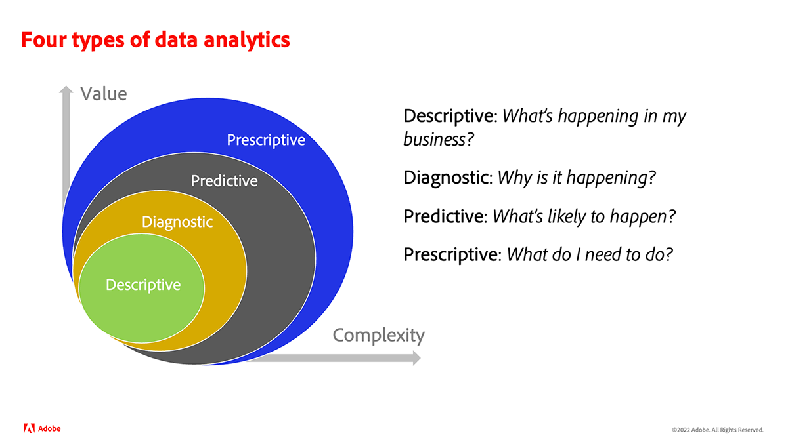

# ¿Qué es analytics?{#what-is-analytics}

Antes de sumergirse en el contenido para aprender a usar Adobe Analytics, es útil conocer la respuesta a esta pregunta fundamental: &quot;¿Qué es Analytics?&quot; Analytics es un término amplio que abarca varias disciplinas para impulsar el desarrollo y la transformación del negocio, a saber, análisis de datos y del negocio. Hay una distinción entre ambos. Analicemos más de cerca.

## El papel del análisis empresarial

En los últimos años, el nacimiento y la madurez del uso de Internet con fines comerciales han explotado, al igual que la cantidad de datos acumulados por las organizaciones sobre cómo los consumidores interactúan y participan en su marca. Si ya ha oído el término Big Data, entra dentro del ámbito del análisis empresarial.

Business analytics es un componente de inteligencia empresarial y se centra en riesgos estratégicos y oportunidades de gran alcance. Es una capacidad necesaria que las empresas deben poseer para seguir siendo competitivas en su industria.

Existen cuatro tipos de análisis empresarial:

* **Descriptiva**: Esto implica utilizar datos históricos para identificar tendencias en el negocio de una organización. Por ejemplo, un minorista debe predecir la demanda de productos antes de las temporadas pico o vacacionales y necesita un inventario óptimo para lograr sus objetivos comerciales.
* **Diagnóstico**: ¿Cuáles son las razones detrás de un resultado inesperado? ¿Por qué hubo una demanda dramática de un producto o servicio durante la temporada baja? El análisis de diagnóstico es una forma más profunda de análisis descriptivo y tiene como objetivo extraer correlaciones de los datos.
* **Predictive**: Esto utiliza datos históricos para determinar resultados o eventos probables. El aprendizaje automático (ML) y la inteligencia artificial (IA) se utilizan habitualmente para predicciones más precisas. La pérdida de clientes es un ejemplo de una aplicación real de análisis predictivos. Este análisis encuentra correlaciones para identificar los atributos de los clientes que es probable que se produzcan, de modo que pueda hacer algo para evitarlo.
* **Receta**: Se trata de una forma avanzada de análisis predictivo que tiene como objetivo descubrir la mejor manera posible de llegar a un resultado deseado. Este tipo de análisis también utiliza tecnologías ML y AI. Los minoristas utilizan el análisis prescriptivo para mejorar los márgenes mediante cambios en sus operaciones.

## La función del análisis de datos

El análisis de datos utiliza muchas de las mismas tecnologías utilizadas en el análisis empresarial, pero tiene un alcance más amplio y un carácter más técnico. El análisis de grandes datos, por ejemplo, depende de la calidad y organización de los datos. ¿Con qué eficacia se ordenan, almacenan y limpian los datos? Los científicos de datos trabajan en el ámbito del análisis de datos. Transforman grandes conjuntos de datos que los analistas de negocios utilizan para comunicar información a la organización con el fin de optimizar procesos y métricas. Los científicos de datos profundizan en los datos, determinando tendencias y conexiones.

## ¿Dónde se adapta Adobe Analytics?

Adobe Analytics es una plataforma sólida de análisis de datos que recopila datos de experiencias digitales de varios canales que admiten el recorrido del cliente y que proporciona herramientas para analizar los datos. Es una plataforma que suelen utilizar los especialistas en marketing y los analistas de negocio con fines de análisis de negocio.

Los requisitos comerciales, el diseño de datos y la recopilación de datos son factores clave para una práctica de análisis eficaz. Inicialmente, los clientes empiezan por recopilar datos sobre los recorridos clave del cliente y los resultados empresariales deseados para experiencias digitales tradicionales, como la web y dispositivos móviles. Los datos deben responder preguntas como:

* &quot;¿Qué tipo de contenido y contenido son populares entre los visitantes?&quot;
* &quot;¿Qué rutas generan conversiones de alto valor, como ingresos, reservaciones, posibles clientes o suscripciones?&quot;
* &quot;¿Qué productos, servicios o contenido debo mostrar a visitantes conocidos y desconocidos?&quot;
* &quot;¿Qué rendimiento tienen los canales de marketing digital?&quot;

Una vez que la base de datos se recopila en Adobe Analytics, los especialistas en marketing y los analistas de negocio utilizan varios informes y herramientas de visualización de datos disponibles en el producto para realizar análisis y contar historias significativas sobre los datos. Además, el Adobe Analytics proporciona varias formas de productos. Podría ser un segmento o una audiencia que se envíe a una herramienta de optimización, como Adobe Target, para ejecutar pruebas A/B. Podría ser una puntuación predictiva para indicar la probabilidad de que una persona utilice otro sistema para modelar una acción.

Con el tiempo, los clientes enriquecen los datos web y móviles tradicionales con otras fuentes de canal, como CRM, centro de llamadas, ladrillo y mortero, asistentes de voz, etc. Adobe Analytics ofrece varias formas de capturar datos desde prácticamente cualquier fuente de canal para crear una base de datos de análisis sólida.

La recopilación de conjuntos de datos adicionales abre la puerta a la realización de tipos más avanzados de análisis de datos prescriptivos que utilizan aprendizaje automático o modelos de datos avanzados, como atribución de marketing y detección de anomalías.

Le recomendamos que consulte los tutoriales de Experience League para guiarle por las ventajas y capacidades clave de Adobe Analytics.
