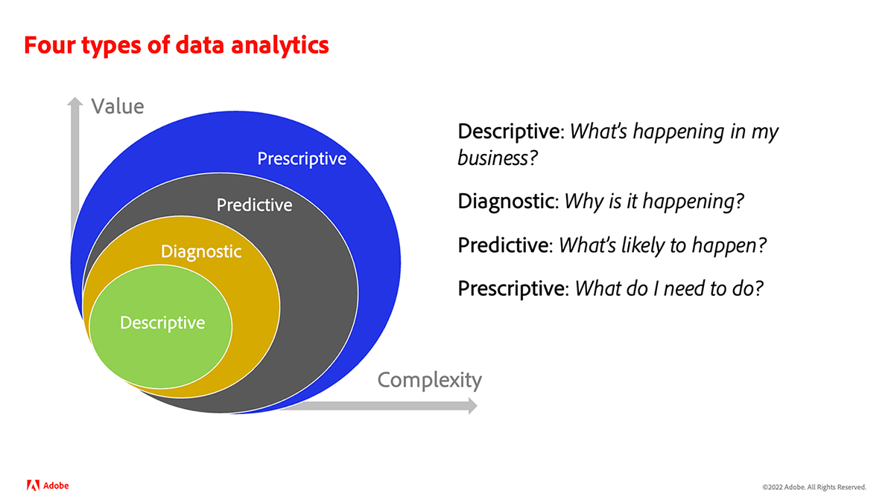
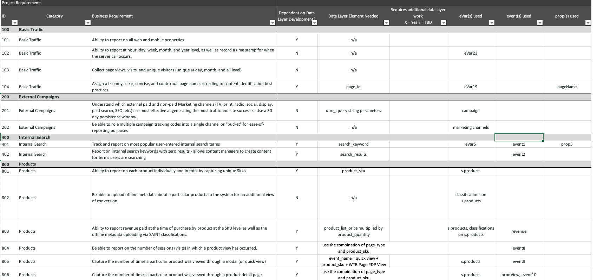
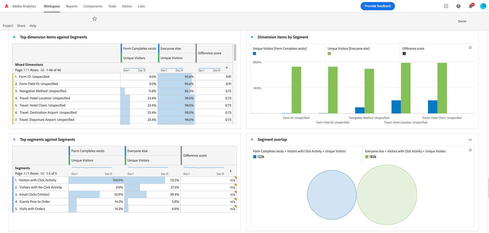

# ¿Qué es el análisis?{#what-is-analytics}

Antes de sumergirse en el contenido para aprender a usar Adobe Analytics, es útil conocer la respuesta a esta pregunta fundamental: “¿Qué es el análisis?” “Análisis” es un término amplio que abarca varias disciplinas para impulsar el desarrollo y la transformación del negocio, a saber: análisis de datos y empresarial. Hay una distinción entre ambos. Veámoslo más de cerca.

## La función del análisis empresarial

En los últimos años, el nacimiento y la madurez del uso de la internet con fines comerciales se han disparado, al igual que la cantidad de datos acumulados por las organizaciones acerca de cómo los consumidores interactúan y se relacionan con su marca. Si ya ha oído hablar del término big data, debe saber que entra dentro del análisis empresarial.

El análisis empresarial es un componente de inteligencia empresarial y se centra en riesgos estratégicos y oportunidades de gran alcance. Es una capacidad necesaria para los negocios si quieren seguir siendo competitivos en su sector.

Existen cuatro tipos de análisis empresarial:

* **Descriptivo**: esto implica utilizar datos históricos para identificar tendencias en el negocio de una organización. Por ejemplo, un minorista debe predecir la demanda de productos antes de las temporadas altas o festivas y necesita tener un inventario óptimo para lograr sus objetivos empresariales.
* **Diagnóstico**: ¿cuáles son las razones de un resultado inesperado? ¿Por qué hubo una demanda extraordinaria de un producto o servicio durante la temporada baja? El análisis diagnóstico es una forma más profunda de análisis descriptivo y tiene como objetivo extraer correlaciones de los datos.
* **Predictivo**: esto utiliza datos históricos para determinar resultados o eventos probables. El aprendizaje automático (AA) y la inteligencia artificial (IA) se utilizan habitualmente para lograr predicciones más precisas. La cancelación de cliente es un ejemplo de una aplicación real de análisis predictivo. Este análisis encuentra correlaciones para identificar los atributos de los clientes que es probable que se pierdan, de modo que pueda hacer algo para evitarlo.
* **Prescriptivo**: se trata de una forma avanzada de análisis predictivo que tiene como objetivo descubrir la mejor ruta posible para llegar a un resultado deseado. Este tipo de análisis también utiliza tecnologías de AA e IA. Los minoristas emplean el análisis prescriptivo para mejorar los márgenes mediante cambios en sus operaciones.

## La función del análisis de datos

El análisis de datos usa muchas de las tecnologías empleadas en el análisis empresarial, pero tiene un ámbito más amplio y un carácter más técnico. El análisis de big data, por ejemplo, depende de la calidad y organización de los datos. ¿Con qué eficacia se ordenan, almacenan y limpian los datos? Los científicos de datos trabajan en el ámbito del análisis de datos. Transforman grandes conjuntos de datos que, después, los analistas empresariales utilizan para comunicar la información a la organización con el fin de optimizar procesos y métricas. Los científicos de datos profundizan en los datos y determinan tendencias y conexiones.

## ¿Dónde entra en juego Adobe Analytics?

Adobe Analytics es una plataforma sólida de análisis de datos que recopila datos de experiencias digitales multicanal que apoyan el recorrido del cliente y proporciona herramientas para analizarlos. Es una plataforma a la que suelen recurrir los especialistas en marketing y los analistas de negocio con fines de análisis empresarial.

Los requisitos empresariales, el diseño de datos y la recopilación de datos son factores clave para una práctica eficaz del análisis. Inicialmente, los clientes empiezan por recopilar datos acerca de los recorridos clave del cliente y los resultados empresariales deseados para experiencias digitales tradicionales, como web y móviles. Los datos deben responder preguntas como las siguientes:

* “¿Qué contenido y tipo de contenido son populares entre los visitantes?”
* “¿Qué rutas generan conversiones de alto valor, como ingresos, reservas, posibles clientes o suscripciones?”
* “¿Qué productos, servicios o contenido debo mostrar a visitantes conocidos y desconocidos?”
* “¿Qué rendimiento tienen los canales de marketing digital?”

Una vez que la base de datos se recopila en Adobe Analytics, los especialistas en marketing y los analistas empresariales utilizan varios informes y herramientas de visualización de datos disponibles en el producto para llevar a cabo análisis y contar historias significativas acerca de los datos. Además, Adobe Analytics proporciona varias formas de resultados. Podría ser un segmento o un público que se envíe a una herramienta de optimización, como Adobe Target, para ejecutar pruebas A/B. Podría ser una puntuación predictiva para indicar la probabilidad de una acción por parte de una persona que otro sistema utiliza para el modelo.

Con el tiempo, los clientes enriquecen los datos web y móviles tradicionales con otras fuentes de canales, como CRM, centros de llamadas, ubicaciones físicas, asistentes de voz, etc. Adobe Analytics ofrece varias formas de capturar datos desde prácticamente cualquier fuente de canal para generar una base de datos de análisis sólida.

La recopilación de conjuntos de datos adicionales abre la puerta a la realización de tipos más avanzados de análisis de datos prescriptivos que utilizan aprendizaje automático o modelos de datos avanzados, como atribución de marketing y detección de anomalías.

Le recomendamos que consulte los tutoriales de Experience League para guiarle por las ventajas y funcionalidades clave de Adobe Analytics.
