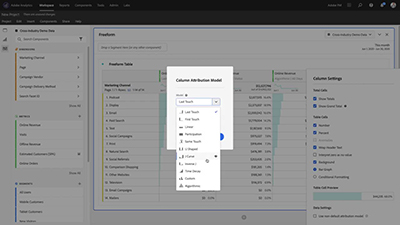
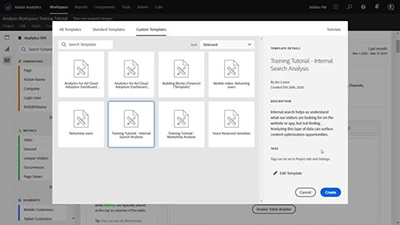
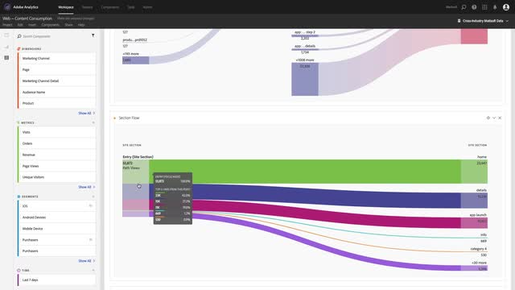

# Tutoriales de Analytics

Saque el máximo partido a [!DNL Adobe Analytics]. Con estos tutoriales aprenderá las funciones de Analytics y obtendrá ventajas para su empresa. Este contenido es adecuado para administradores, analistas de datos, especialistas en marketing, desarrolladores y arquitectos.

En primer lugar,

* Consulte la sección **&quot;Novedades&quot;** para conocer las actualizaciones y funciones más recientes
* **Selección de personal** destaca algunos de nuestros contenidos favoritos
* Explore el contenido por tema y subtema en la navegación de la **izquierda**
* Utilice el campo de **búsqueda** que hay al principio de la página si sabe lo que quiere aprender

En la sección de cursos también se ofrecen experiencias de aprendizaje organizadas por función y nivel de habilidad. Solo tiene que iniciar sesión con su Adobe ID e ir a **Formación > Cursos recomendados** en la barra de navegación superior.

## Selección de personal

<table>
<tr>
  <td>
    
    

      <a href="analysis-workspace/attribution-iq/algorithmic-model-in-attribution-iq.md">
    <strong>Modelo algorítmico en Attribution IQ</strong>
    </a>
    

    

    <em>El modelo de atribución algorítmica de Analysis Workspace utiliza técnicas estadísticas para determinar dinámicamente la asignación óptima de crédito para la métrica seleccionada.</em>
    

  </td>
   <td>
    
    

      <a href="analysis-workspace/navigating-workspace-projects/training-tutorial-template-in-analysis-workspace.md">
    <strong>Plantilla de tutorial de formación en Analysis Workspace</strong>
    </a>
    

    

    <em>El tutorial de formación de Analysis Workspace guía a los usuarios por la terminología común y los pasos necesarios para crear su primer análisis en Workspace.</em>
    

  </td>
  <td>
    
    

      <a href="analysis-workspace/analysis-workspace-basics/analysis-workspace-overview.md">
    <strong>Información general de Analysis Workspace</strong>
    </a>
    

    

    <em>Información general de alto nivel sobre Analysis Workspace.</em>
    

  </td>
</tr>
</table>

## Recursos adicionales

[Documentación de Adobe Analytics](https://experienceleague.adobe.com/docs/analytics.html?lang=es)
