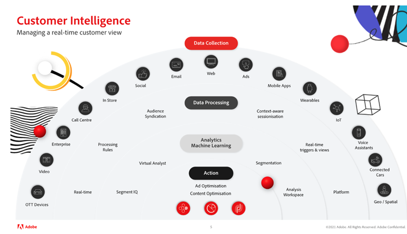

# Dominio del conocimiento del cliente con Analista virtual y Segment IQ en Adobe Analytics

En este artículo, aprenderá la importancia de utilizar la inteligencia artificial y el aprendizaje automático (AI/ML). A continuación, revise las ventajas y los casos de éxito del mundo real de los clientes globales que utilizan Analista virtual y Segment IQ para detectar anomalías, evitar periféricos y maximizar el ROI.

## El valor de la inteligencia artificial

Quizás recuerde la vez que [!DNL Deep Blue] de IBM® derrotó al campeón de ajedrez Garry Kasparov. Los expertos estaban convencidos de que una máquina no podía vencer la toma de decisiones y el juicio humanos en un juego tan complejo. Sin embargo, lo hizo, y esto fue clave para un cambio fundamental en la estrategia empresarial y la innovación tecnológica, a medida que se descubría el poder de la inteligencia artificial.

Adobe Analytics es el sistema básico de inteligencia para el negocio de la experiencia, que permite a cualquier persona de la empresa comprender y optimizar las interacciones de los clientes con su marca en todos los puntos de contacto en tiempo real y a escala masiva.

Las herramientas de IA de Adobe no están aquí para reemplazarlo, sino para permitirle lograr el máximo ROI en sus esfuerzos.

## Transforme el análisis

Para desarrollar los análisis, debemos centrarnos en tres consideraciones clave:

1. Organización: cómo crear vistas integrales de los clientes, priorizar las decisiones basadas en las perspectivas y democratizar los datos.

1. Tecnología: cómo asegurar que los datos y la tecnología ofrezcan personalización a escala.

1. Cliente: cómo crear confianza y adaptarse al cambio.

Analytics supone un reto y requiere tiempo, pero existe una necesidad constante de acelerar el tiempo de obtención de los datos. Entre los problemas clave que enfrentan las organizaciones están los siguientes:

* Recursos organizativos limitados: diversos objetivos del negocio pueden limitar la disponibilidad de recursos
* Experiencia técnica limitada: ¿se puede compartir el conocimiento y democratizar los datos?
* Expectativas del cliente: ¿puede su equipo reaccionar de forma dinámica a los cambios en el comportamiento de los clientes?

## Domine el conocimiento del cliente con el Asistente virtual, con tecnología de Adobe Sensei

### 3 niveles de conocimiento del cliente

Cuando se trata de una estrategia de conocimiento del cliente exitosa, necesitamos avanzar tres niveles (ver Figura 1 anterior) desde: (a) recopilación de datos, a (b) procesamiento de datos, a (c) análisis y aprendizaje automático, antes de que por fin podamos tomar medidas y optimizar nuestro contenido y nuestros anuncios.

1. La recopilación de datos depende de su organización y puede incluir varios canales y medios. Estos incluyen dispositivos OTT, vídeo, empresa, centros de llamadas, en tienda, correo electrónico social, web, anuncios, aplicaciones móviles, wearables, IoT, asistentes de voz, tarjetas conectadas y ubicación geográfica/espacial.

1. El procesamiento de datos incluye la recopilación de datos en tiempo real, las reglas de procesamiento, la distribución de públicos, la sesionización según el contexto, los activadores y las vistas en tiempo real y la plataforma.

1. El aprendizaje automático de Analytics incluye Segment IQ, Analista virtual, Segmentación, Analysis Workspace

### Aproveche su Analista virtual

Piense en [Analista virtual](https://experienceleague.adobe.com/docs/analytics/analyze/analysis-workspace/virtual-analyst/overview.html?lang=es) como el analista estrella del rock que:

* Nunca abandona la oficina ni lo necesita
* Indica el quién, qué, cuándo, dónde, por qué y así qué de su negocio
* Actúa al instante con alertas inteligentes de la monitorización de anomalías ininterrumpida de todos los datos
* Es capaz de remasterizar componentes para [!UICONTROL Analysis Workspace]

### Descubre oportunidades ocultas

* Consigue visibilidad al minuto del estado de los KPI de marketing
* Hace que las buenas inversiones de marketing sean fiables y predecibles
* Sigue el ritmo de las expectativas de los clientes y las supera

### Éxito en el mundo real

El Analista virtual reveló los siguientes escenarios para clientes reales de Adobe:

* Finalización de la campaña: aumento diario de 1,7 millones de dólares en los ingresos, debido sobre todo a una campaña que se había terminado prematuramente.
* Error del proveedor: aumento del 73 % en eliminaciones del carro de compras por un error del administrador de etiquetas que borraba de forma automática ciertos productos.
* Problema con el explorador: aumento del 8 % en abandonos del carro de compras asociado a los exploradores Chrome. Esta corrección permitió aumentar los ingresos en 1,2 millones de dólares diarios.
* Fraude de cupones: identificó un aumento del 81 % en los pedidos causados por el tráfico referido por dos grandes sitios de ofertas diarias/cupones que promocionaban cupones de artículos de higiene personal fraudulentos. Estos pedidos se pudieron cancelar.
* Espionaje corporativo: aumento del 200 % en las visitas causado por bots/rastreadores creados por un competidor principal para robar contenido del sitio y reutilizarlo. Estas IP pudieron bloquearse.

## Funcionalidades de Adobe Analytics

[Detección de anomalías](https://experienceleague.adobe.com/docs/analytics/analyze/analysis-workspace/virtual-analyst/anomaly-detection/anomaly-detection.html?lang=es):

* Utilice algoritmos predictivos integrados para ayudar a identificar picos y caídas en los datos que no sabía que existían.
* Aproveche 28 algoritmos únicos para identificar anomalías, como temporalidad, crecimiento y modelos cíclicos, así como alineación de festivos.
* Reduzca la dependencia en los científicos de datos y desbloquee las capacidades de los científicos de datos ciudadanos.

[Análisis de contribución](https://experienceleague.adobe.com/docs/analytics/analyze/analysis-workspace/virtual-analyst/contribution-analysis/ca-tokens.html?lang=es):

* Identifique rápidamente los factores que han provocado cambios significativos en sus datos.
* Ahorre incontables horas de búsqueda de explicaciones a los cambios en las métricas.
* Aproveche el potente aprendizaje automático diseñado para transformar al analista y al experto en marketing en un científico de datos.

[Alertas inteligentes](https://experienceleague.adobe.com/docs/analytics/analyze/analysis-workspace/virtual-analyst/intelligent-alerts/intellligent-alerts.html?lang=es):

Manténgase informado de anomalías en los datos en todo momento, en la oficina o fuera de ella

* Cree alertas directamente desde Analysis Workspace
* Base las reglas en anomalías (90 %, 95 %, 99 %), cambio de % y superiores/inferiores
* Use [!UICONTROL Vista previa de alertas] para ver con qué frecuencia se habría activado una alerta
* Aproveche la compatibilidad de SMS y correo electrónico con vínculos a proyectos autogenerados de [Analysis Workspace](https://experienceleague.adobe.com/docs/analytics/analyze/analysis-workspace/home.html?lang=es)

[IQ de segmento](https://experienceleague.adobe.com/docs/analytics/analyze/analysis-workspace/segment-iq.html?lang=es):

* Descubra las diferencias y superposiciones entre sus segmentos para informar la estrategia de segmentación
* Descubra las características clave de los segmentos de público que impulsan los KPI
* Obtenga informes y visualizaciones de segundos a minutos que muestren elementos comunes en dimensiones, métricas y otros segmentos
* Mejore la participación con clientes de alto valor

## Éxito real con Segment IQ

**Móvil frente a escritorio:** “Comparamos las visitas de uno de nuestros sitios con las de otro y enseguida detectamos un montón de incoherencias en el etiquetado”. → Evitar problemas de datos antes del lanzamiento de un producto

**Uso de funciones:** “Comprobamos que los clientes que usaban nuestra función de comparación de productos tenían una probabilidad un 10 % mayor de realizar una conversión. Al moverla a la parte superior de la página, aumentaron los pedidos”. → Aumento del 4 % en la conversión

**Participación en el contenido:** “Descubrimos que los visitantes de nuestra sección de noticias duplicaban la probabilidad de ver anuncios de vídeo, así que añadimos más opciones de vídeo en esa sección”. → Aumento del 7 % en los anuncios de vídeo vistos

**Búsqueda de pago:** “Los visitantes procedentes de los motores de búsqueda tenían el triple de probabilidades de comprar más. Como resultado, aumentamos el gasto en palabras clave específicas”. → Impulsar ventas un 56 %

**Agotamiento de existencias de productos:** “La gente que compraba Fitbits tenía 6 veces más probabilidades de sufrir una falta de existencias que el resto, por lo que enseguida pedimos más Fitbits”. → Se evitó el agotamiento de existencias y se completaron más pedidos de vacaciones

Para obtener más información, vea nuestro [seminario web](https://adobecustomersuccess.adobeconnect.com/pmetho6ivh68/).

Obtenga más información acerca de la estrategia y el liderazgo mental en el centro [Éxito del cliente](https://experienceleague.adobe.com/docs/customer-success/customer-success/overview.html?lang=es).